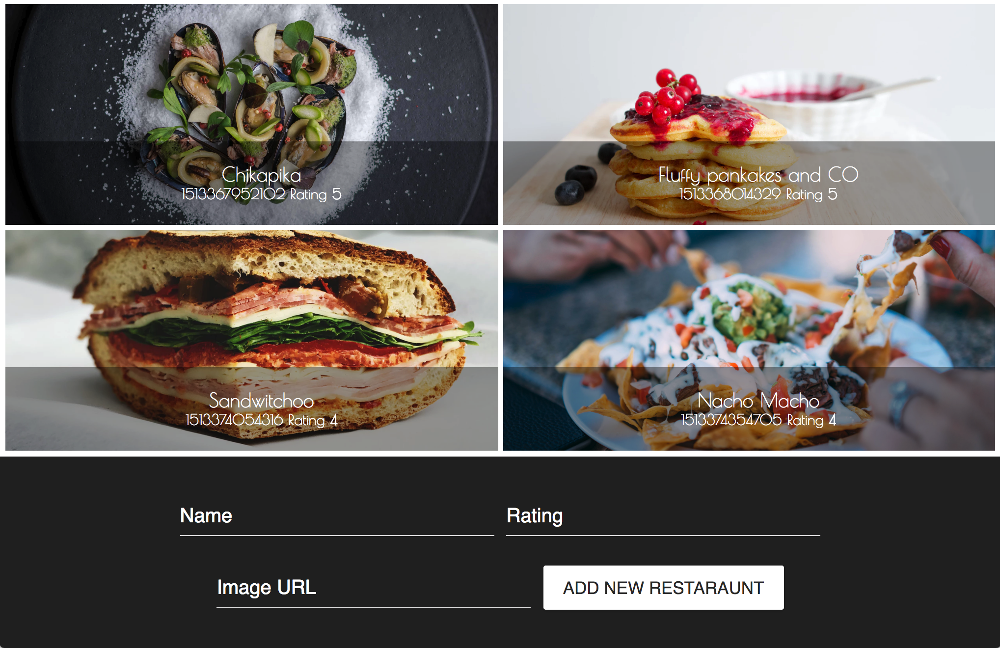

# Doggy Restaurants

## Back-End

Create a server with ExpressJS and a MongoDB database with the following API endpoints:

- `POST /restaurants`

 Creates a new restaurant with the following values

- `name`
- `rating` – float between 0 and 5
- `picture` – string containing a url with a picture of the restaurant

- `GET /restaurants`

 Returns a list of all resutaurants in the database in JSON format.
 It should accept a query parameter `order_by`, and it should sort the results usint this field. This field can take the values name and rating, de default should be `id`, or date created.

 ## Front-End

 Create a client that consumes the previous back-end. This client should be developed using React + Redux.

 It should have a single view listing all the restaurants given by the server.

 There will be a selector that lets us sort the elements by the given field (`name`, `rating` or `date created`). When the user selects a new value on this selector, it should fetch the list again and show it with the correct order.
